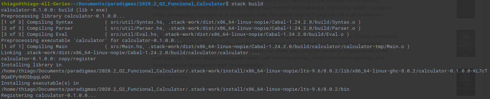
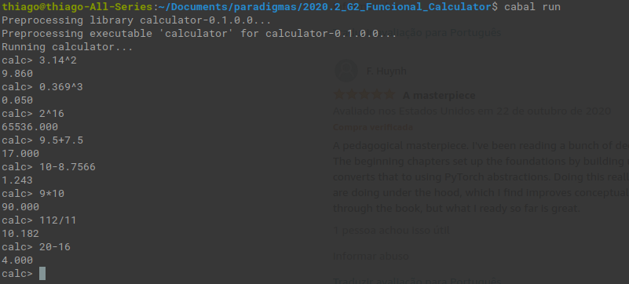

# Calculadora Funcional

**Disciplina**: FGA0210 - PARADIGMAS DE PROGRAMAÇÃO - T01  
**Nro do Grupo**: 2 
**Paradigma**: Funcional 

## Alunos
|Matrícula | Aluno |
| -- | -- |
| 15/01499948  |  Thiago Ferreira |
| 17/0062686  |  Pedro Rodrigues Pereira |
| 17/0008371  |  Daniel de Sousa Oliveira Melo Veras |

## Sobre 
O projeto desenvolvido pela equipe consiste em uma calculadora básica escrita na linguagem Cabal, contendo as funções de adição, subtração, multiplicação, divisão e exponencial.

## Screenshots

## Instalação 
**Linguagens**: Haskell 
**Tecnologias**: Haskell, Cabal 
Para executar o projeto, é necessário ter o haskell, haskell-stack, ghci e cabal.

Ao ter todos os pre-requisitos cumpridos,basta executar os seguinte comandos:
* stack build
* cabal run

Com isso, o projeto estará rodando e pronto para ser utilizado na linha de comando.

## Uso 
Explique como usar seu projeto, caso haja algum passo a passo após o comando de execução.

## Vídeo
https://youtu.be/PAqbKi1IBoI
